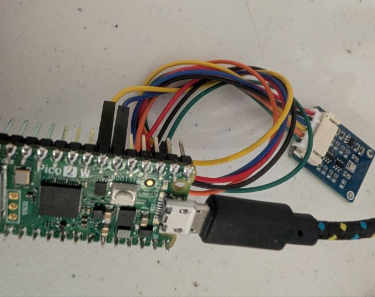
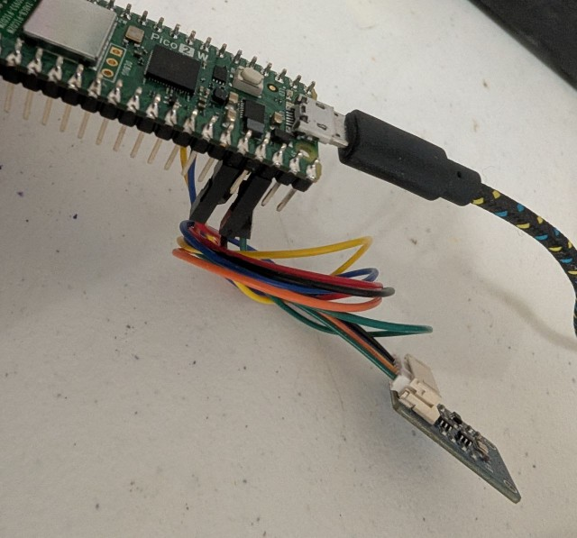
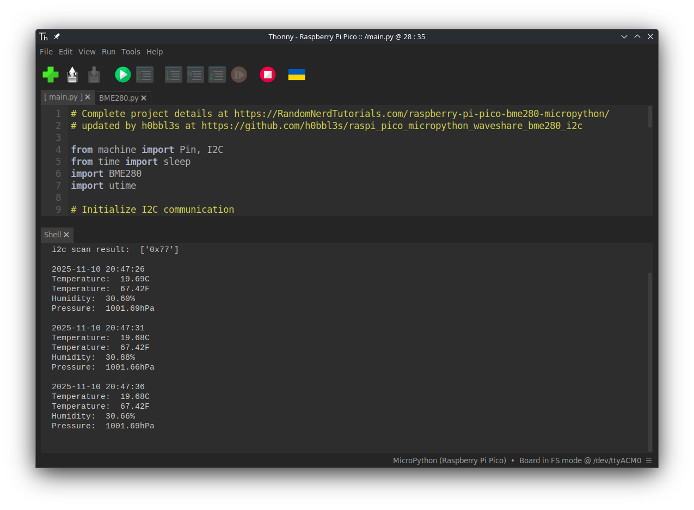

# Environmental sensor with the Raspberry Pi Pico, Microython, BME280, and I2C!

This is a demonstration project for the raspberry pi pico and waveshare bme280 sensor using i2c.
The code is from the [RandomNerdTutorials.com](https://randomnerdtutorials.com/raspberry-pi-pico-bme280-micropython/) blog post on the subject with a few of my own improvements.

## Details

This code will scan the i2c bus and print any found devices, initialize a waveshare BME280 Environmental sensor 
at the proper address, and then print timestamped outputs of the temperature in F and C, the humidity, and the Pressure in hPa.
To get started simply save the main.py and BME280.py to a raspberry pi pico running micropython, wire up your module, and run the program!
I'll leave it to you to read the original blog post for more detail as they did a good job, but I will demonstrate my simplified wiring.

From Pico to BME  
Pin 6(GP4, I2C0 SDA) to SDA  
Pin 7(GP5, I2C0 SCL) to SCL  
GND to GND  
3.3v out to VCC  

 

## Improvements

Added a one time i2c scan to ensure correct module address
Changed BME280.py to reflect the default address for the waveshare module.
Added in use of the onboard RTC on the pico for timestamping the readings.

## Notes

I had issues with my board being on the wrong address at first and pinned it down to this
from the datasheet.

> The 7-bit device address is 111011x. The 6 MSB bits are fixed. The last bit is changeable by
> SDO value and can be changed during operation. Connecting SDO to GND results in slave
> address 1110110 (0x76); connection it to VDDIO results in slave address 1110111 (0x77), which
> is the same as BMP280’s I²C address. The SDO pin cannot be left floating; if left floating, the
> I²C address will be undefined.

On the waveshare board the SDO(ADDR on the board) is pulled high by default giving an address of 0x77.

The waveshare BME280 can also run in SPI mode and has many other features worth checking out.
You can find more including a link to the datasheet on the [Waveshare website](https://www.waveshare.com/wiki/BME280_Environmental_Sensor)

